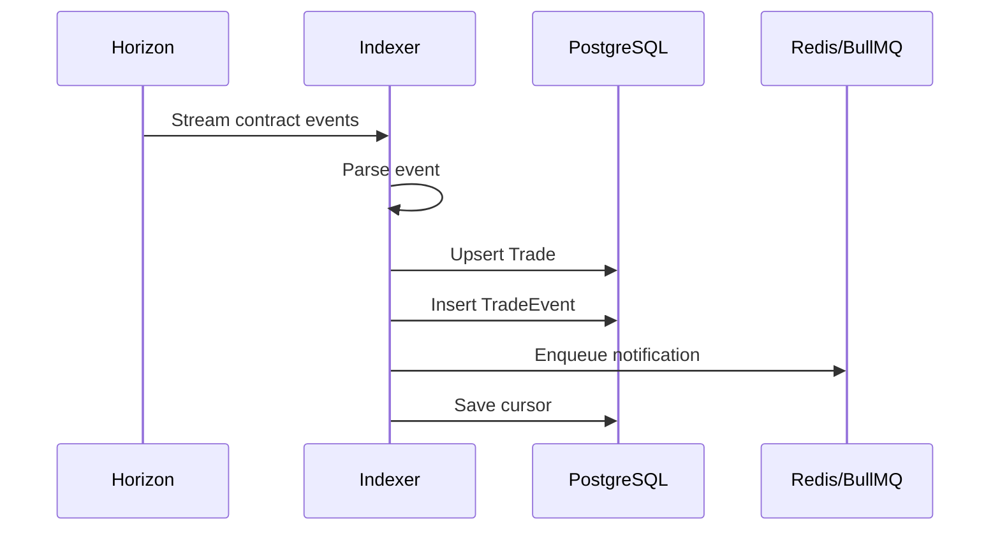
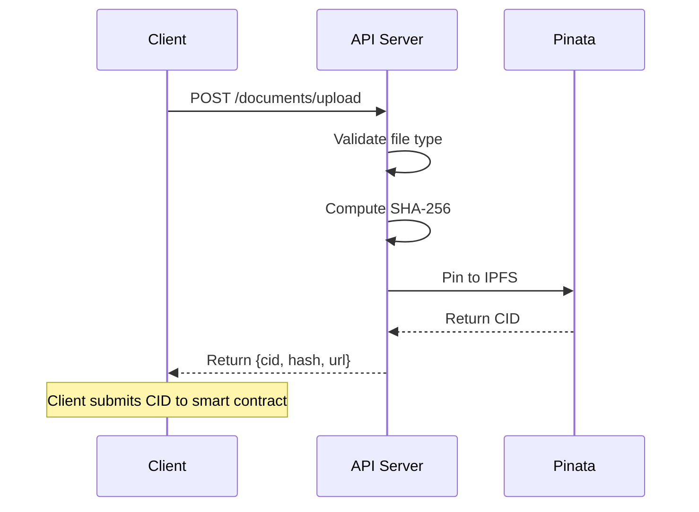
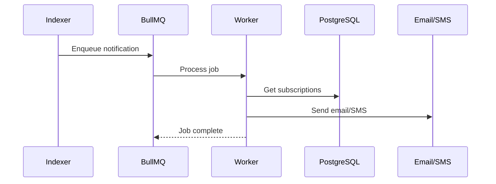

# Azaka API - Project Structure

Complete file tree and architecture overview.

## Directory Tree

```
azaka-api/
├── .github/workflows/          # CI/CD pipelines
├── docker/                     # Docker configs
├── prisma/                     # Database schema & migrations
├── src/
│   ├── api/                    # REST API server (Express)
│   ├── config/                 # Environment validation
│   ├── db/                     # Prisma client
│   ├── indexer/                # Horizon event listener
│   ├── ipfs/                   # Pinata integration
│   ├── jobs/                   # BullMQ workers & cron
│   ├── notifications/          # Email & SMS
│   ├── types/                  # TypeScript types
│   └── utils/                  # Logging utilities
├── tests/                      # Vitest test suites
└── [config files]              # .env, tsconfig, etc.
```

## Key Components

### 1. Indexer (`src/indexer/`)

**Purpose**: Listen to Stellar Horizon for contract events and index them to PostgreSQL.

**Critical Files**:
- `cursor.ts` - Persists Horizon cursor (most critical reliability piece)
- `index.ts` - Main event loop with exponential backoff
- `handlers/*.ts` - Event-specific processors

**Flow**:
```
Horizon Stream → Parse Event → Route to Handler → Update DB → Enqueue Notification → Save Cursor
```

### 2. API Server (`src/api/`)

**Purpose**: Provide fast REST queries for trades, documents, and participants.

**Endpoints**:
- `GET /health` - Health check with indexer lag
- `GET /trades` - List trades (paginated, filterable)
- `GET /trades/:id` - Trade details
- `GET /trades/:id/timeline` - Event timeline
- `POST /documents/upload` - Upload to IPFS (authenticated)
- `GET /documents/:tradeId` - List documents
- `GET /participants/:address` - Participant lookup
- `POST /notifications/subscribe` - Subscribe (authenticated)

### 3. Notifications (`src/notifications/`)

**Purpose**: Send email and SMS notifications to trade participants.

**Integrations**:
- **Resend** - Email delivery
- **Termii** - SMS delivery (Nigeria-focused)

**Templates**:
- Trade created
- Escrow deposited
- Document required
- Trade settling
- Trade expiring (48h warning)

### 4. Background Jobs (`src/jobs/`)

**Purpose**: Process notifications and run maintenance tasks.

**Queues**:
- `notifications` - Email/SMS delivery with retry
- `maintenance` - Cron jobs

**Cron Jobs**:
- `expiryWatcher` - Hourly check for trades expiring in 48h
- `settlementSweep` - Every 6h, flag stale trades

### 5. IPFS (`src/ipfs/`)

**Purpose**: Store trade documents on IPFS via Pinata.

**Functions**:
- `uploadDocument()` - Pin file to IPFS
- `getDocumentUrl()` - Get gateway URL
- `unpinDocument()` - Remove pin (for cancelled trades)

## Data Flow

### Event Indexing



### Document Upload



### Notification Flow



## Database Schema

### Core Tables

- **Trade** - Trade records with status
- **Document** - Document metadata with IPFS CIDs
- **TradeEvent** - Immutable event log
- **Participant** - Registered participants
- **NotificationSubscription** - Email/SMS subscriptions
- **IndexerCursor** - Singleton cursor persistence

### Indexes

All foreign keys and frequently queried fields are indexed for performance.

## Configuration

### Environment Variables (Zod validated)

**Required**:
- Database: `DATABASE_URL`, `REDIS_URL`
- Stellar: `HORIZON_URL`, `SOROBAN_RPC_URL`, `STELLAR_NETWORK`
- Contracts: 4 contract IDs
- APIs: Pinata, Resend, Termii keys
- Security: `API_KEY` (32+ chars)

**Optional**:
- `PORT` (default: 3001)

## Testing

### Test Structure

```
tests/
├── api/              # API endpoint tests (supertest)
├── config/           # Environment validation tests
├── indexer/          # Cursor persistence tests
└── notifications/    # Template rendering tests
```

### Running Tests

```bash
pnpm test              # Run all tests
pnpm test:watch        # Watch mode
pnpm typecheck         # Type checking
pnpm lint              # Linting
```

## Deployment

### Services Required

1. **API Server** - Stateless, horizontally scalable
2. **Indexer** - Single instance only (cursor coordination)
3. **PostgreSQL** - Persistent storage
4. **Redis** - Job queues

### Scaling Guidelines

- **API**: Scale horizontally (add instances)
- **Indexer**: DO NOT scale horizontally (single instance)
- **Database**: Use connection pooling, read replicas
- **Redis**: Use Redis Cluster for HA

## Critical Reliability Points

### 1. Cursor Persistence

The indexer cursor MUST survive restarts. Implementation:
- Saved every 10 events
- Uses upsert for atomicity
- Errors logged as CRITICAL
- On restart, resumes from last saved cursor

### 2. Event Handler Resilience

Event handlers MUST NOT crash the indexer:
- All errors caught and logged
- Malformed events skipped
- Processing continues on error

### 3. Stateless Design

API and indexer are stateless (except DB/Redis):
- Multiple API instances can run safely
- Only one indexer instance should run
- No local state or file storage

## Monitoring

### Key Metrics

- **Indexer lag** - Seconds since last cursor update
- **API response time** - P50, P95, P99
- **Error rate** - Failed events, API errors
- **Queue depth** - BullMQ notification backlog

### Health Check

```bash
curl https://api.azaka.finance/health
```

Response:
```json
{
  "success": true,
  "data": {
    "status": "ok",
    "indexerLag": 5,
    "timestamp": "2024-01-01T00:00:00.000Z"
  }
}
```

## Security

- API key authentication for mutating endpoints
- Rate limiting (100 req/15min per IP)
- Input validation on all endpoints
- File type validation for uploads
- No private keys or funds custody

## License

MIT - See LICENSE file
