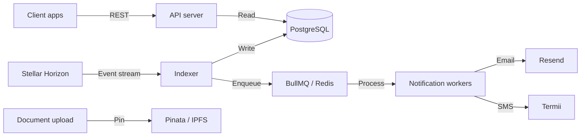

# Azaka Backend

[](https://github.com/Azaka-Protocol/Azaka-backend/actions/workflows/ci.yml)
[](https://github.com/Azaka-Protocol/Azaka-backend/actions/workflows/docker.yml)
[](https://opensource.org/licenses/MIT)

Optional infrastructure backend for the [Azaka](https://github.com/Azaka-Protocol) decentralized trade finance protocol on Stellar/Soroban.

This repository (**[Azaka-backend](https://github.com/Azaka-Protocol/Azaka-backend)**) complements the on-chain protocol in **[Azaka-contracts](https://github.com/Azaka-Protocol/Azaka-contracts)**. Smart contracts enforce trade rules and custody; this service handles what contracts cannot do well: **document storage**, **event-driven notifications**, and **fast indexed queries**.

> **Note:** The npm package name is `azaka-api` for historical reasons. The GitHub repository and Docker images use **Azaka-backend**.

## Protocol relationship

| Layer | Repository | Role |
|-------|------------|------|
| On-chain | [Azaka-contracts](https://github.com/Azaka-Protocol/Azaka-contracts) | Soroban contracts (trade, escrow, documents, registry) |
| Off-chain (this repo) | [Azaka-backend](https://github.com/Azaka-Protocol/Azaka-backend) | Indexer, REST API, IPFS pinning, notifications |

Deploy contract IDs from your network into `.env` (see [`.env.example`](./.env.example)). The indexer reads events from Stellar Horizon for those contracts.

The protocol **works without this service** — it is optional infrastructure for production-grade UX, not a critical path for settlement.

## What this service does (and does not)

**Does:**

- Index trade events from Stellar Horizon in near real time
- Store trade documents on IPFS (Pinata)
- Send email and SMS notifications to participants
- Expose a REST API for trades, documents, and participants
- Monitor trade expiry and flag stale trades (planned areas in alpha roadmap)

**Does not:**

- Hold private keys or sign transactions
- Custody funds or control escrow
- Act as a gatekeeper for trade execution
- Make on-chain decisions

## Alpha scope (~40% implemented)

The backend mirrors a deliberate **alpha slice** of the Soroban contracts so contributors have clear ownership areas. The live boundary is exposed at:

```bash
curl http://localhost:3001/capabilities
```

**Implemented now:**

- Trade creation indexing and trade query APIs
- Escrow deposit indexing and exporter notification
- Document upload, SHA-256 hashing, and IPFS pinning
- Participant read-model lookup

**Planned contributor areas:**

- On-chain document submission indexing
- Signature accumulation and required approval checks
- Settlement and escrow release indexing
- Cancellation and refund indexing
- Expiry monitoring and expiry event indexing
- Registry authorization lifecycle indexing

See [CONTRIBUTING.md](./CONTRIBUTING.md) for how to pick up planned work.

## Architecture



## Prerequisites

- **Node.js** 20+ ([`.nvmrc`](./.nvmrc))
- **pnpm** 8+
- **PostgreSQL** 16+
- **Redis** 7+
- **Docker** (optional, for local Postgres/Redis/API/indexer)

## Quickstart

### 1. Get the code

**Running locally (read-only):**

```bash
git clone https://github.com/Azaka-Protocol/Azaka-backend.git
cd Azaka-backend
pnpm install
```

**Contributing (fork → pull request):**

All code changes are submitted via PRs from your fork, not by pushing to `Azaka-Protocol/Azaka-backend`.

1. Fork [Azaka-backend](https://github.com/Azaka-Protocol/Azaka-backend) on GitHub.
2. Clone your fork and add upstream:

```bash
git clone https://github.com/YOUR_GITHUB_USERNAME/Azaka-backend.git
cd Azaka-backend
git remote add upstream https://github.com/Azaka-Protocol/Azaka-backend.git
pnpm install
```

3. After you make changes, push to your fork and open a PR into `Azaka-Protocol/Azaka-backend` → `main`.

Full steps: [CONTRIBUTING.md](./CONTRIBUTING.md#submitting-changes-fork--pull-request).

### 2. Configure environment

```bash
cp .env.example .env
```

Set at minimum:

| Variable | Description |
|----------|-------------|
| `DATABASE_URL` | PostgreSQL connection string |
| `REDIS_URL` | Redis connection string |
| `HORIZON_URL` | Stellar Horizon endpoint |
| `SOROBAN_RPC_URL` | Soroban RPC endpoint |
| `STELLAR_NETWORK` | `testnet` or `mainnet` |
| `TRADE_CONTRACT_ID` | From [Azaka-contracts](https://github.com/Azaka-Protocol/Azaka-contracts) deployment |
| `ESCROW_CONTRACT_ID` | Same |
| `DOCUMENT_CONTRACT_ID` | Same |
| `REGISTRY_CONTRACT_ID` | Same |
| `PINATA_API_KEY` / `PINATA_SECRET_KEY` | IPFS pinning |
| `RESEND_API_KEY` | Email |
| `TERMII_API_KEY` | SMS |
| `API_KEY` | 32+ character secret for authenticated routes |

### 3. Run with Docker Compose

```bash
docker compose -f docker/docker-compose.yml up
```

Starts PostgreSQL (`5432`), Redis (`6379`), API (`3001`), and the indexer.

### 4. Run locally (without Docker)

```bash
# With Postgres and Redis running locally:
pnpm prisma migrate deploy
pnpm prisma generate

# Terminal 1 — API
pnpm api

# Terminal 2 — indexer
pnpm indexer
```

Or use the helper script:

```bash
pnpm setup   # first-time setup
pnpm dev     # API + indexer together
```

## API reference

Responses use:

```json
{
  "success": true,
  "data": { }
}
```

### Public endpoints

| Method | Endpoint | Description |
|--------|----------|-------------|
| `GET` | `/health` | Health check and indexer lag |
| `GET` | `/capabilities` | Alpha capability map and contributor roadmap |
| `GET` | `/trades` | List trades (paginated, filterable) |
| `GET` | `/trades/:id` | Trade details |
| `GET` | `/trades/:id/timeline` | Trade event timeline |
| `GET` | `/documents/:tradeId` | Documents for a trade |
| `GET` | `/participants/:address` | Participant details |

### Authenticated endpoints

Require the `X-API-Key` header.

| Method | Endpoint | Description |
|--------|----------|-------------|
| `POST` | `/documents/upload` | Upload document to IPFS |
| `POST` | `/notifications/subscribe` | Subscribe to notifications |
| `DELETE` | `/notifications/subscribe` | Unsubscribe |

### Examples

```bash
# List active trades
curl "http://localhost:3001/trades?status=Active&page=1&limit=20"

# Upload a document
curl -X POST http://localhost:3001/documents/upload \
  -H "X-API-Key: your-api-key" \
  -F "file=@bill-of-lading.pdf" \
  -F "tradeId=trade-123" \
  -F "docType=BillOfLading"
```

Further deployment notes: [DEPLOYMENT.md](./DEPLOYMENT.md). Step-by-step local guide: [GETTING_STARTED.md](./GETTING_STARTED.md).

## Development

```bash
pnpm test          # unit / integration tests
pnpm typecheck     # TypeScript
pnpm lint          # ESLint
pnpm lint:fix
```

Database:

```bash
pnpm prisma migrate dev --name your_change   # create migration (dev)
pnpm prisma migrate deploy                   # apply (CI / production)
pnpm db:studio                               # Prisma Studio
```

CI runs on every push and PR to `main`: install, migrate, typecheck, lint, and test. See [`.github/workflows/ci.yml`](./.github/workflows/ci.yml).

## Project structure

```
Azaka-backend/
├── src/
│   ├── indexer/           # Horizon event stream
│   ├── api/               # Express REST API
│   ├── notifications/     # Email & SMS templates
│   ├── ipfs/              # Pinata integration
│   ├── jobs/              # BullMQ workers
│   ├── protocol/          # Capability map (alpha boundaries)
│   └── config/            # Env validation
├── prisma/                # Schema and migrations
├── tests/
├── docker/
└── .github/workflows/
```

## Deployment

- **PaaS** (Railway, Render, Fly.io): deploy API and indexer as separate processes; provision Postgres and Redis. See [DEPLOYMENT.md](./DEPLOYMENT.md).
- **Docker**: `docker build -f docker/Dockerfile -t azaka-backend .`
- **GHCR** (on version tags / releases):

  ```bash
  docker pull ghcr.io/azaka-protocol/azaka-backend:latest
  ```

## Contributing

Contributions are welcome through **issues** and **pull requests from forks**. Outside contributors should not push branches directly to this repository.

### Fork workflow

1. **Fork** the repo on GitHub: [Azaka-Protocol/Azaka-backend](https://github.com/Azaka-Protocol/Azaka-backend).
2. **Clone your fork** and track upstream:
   ```bash
   git clone https://github.com/YOUR_GITHUB_USERNAME/Azaka-backend.git
   cd Azaka-backend
   git remote add upstream https://github.com/Azaka-Protocol/Azaka-backend.git
   ```
3. **Sync** before you branch:
   ```bash
   git fetch upstream
   git checkout main
   git merge upstream/main
   git push origin main
   ```
4. **Branch**, implement, and run checks:
   ```bash
   git checkout -b feature/your-change
   pnpm typecheck && pnpm lint && pnpm test
   ```
5. **Push to your fork** and open a PR:
   ```bash
   git push origin feature/your-change
   ```
   On GitHub, open a pull request: **base** `Azaka-Protocol/Azaka-backend` `main` ← **head** your fork / `feature/your-change`.

### Before you open a PR

- Search [existing issues](https://github.com/Azaka-Protocol/Azaka-backend/issues) or open one for larger changes.
- Check `GET /capabilities` (or `src/protocol/capabilities.ts`) for alpha scope and planned work.
- Ensure CI passes on your PR (typecheck, lint, test).

Details, code style, and the review checklist: **[CONTRIBUTING.md](./CONTRIBUTING.md)**.

Smart contract changes belong in **[Azaka-contracts](https://github.com/Azaka-Protocol/Azaka-contracts)** (also via fork → PR).

## Security

Do not open public issues for security vulnerabilities. Report them via [GitHub Security Advisories](https://github.com/Azaka-Protocol/Azaka-backend/security/advisories/new) for this repository.

## License

[MIT](./LICENSE) © Azaka Protocol contributors
