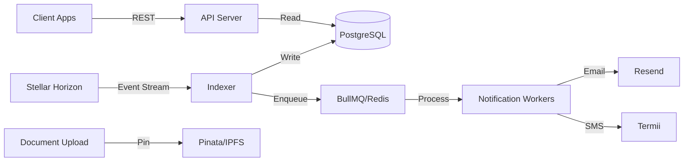

# Azaka API

[](https://github.com/azaka/azaka-api/actions/workflows/ci.yml)
[](https://github.com/azaka/azaka-api/actions/workflows/docker.yml)
[](https://opensource.org/licenses/MIT)

Optional infrastructure backend for the Azaka decentralized trade finance protocol. This service handles the three things Soroban smart contracts cannot do well: **document storage**, **event-driven notifications**, and **fast indexed queries**.

## Alpha Scope: 40% Implemented

This backend intentionally mirrors only the stable alpha slice of the Soroban contracts so open-source contributors have clear ownership areas. The current implementation boundary is exposed at:

```bash
curl http://localhost:3001/capabilities
```

Implemented now:
- Trade creation indexing and trade query APIs
- Escrow deposit indexing and exporter notification
- Document upload, SHA-256 hashing, and IPFS pinning
- Participant read model lookup

Planned contributor areas:
- On-chain document submission indexing
- Signature accumulation and required approval checks
- Settlement and escrow release indexing
- Cancellation and refund indexing
- Expiry monitoring and expiry event indexing
- Registry authorization lifecycle indexing

Planned contract events are deliberately skipped by the alpha indexer until their handlers and tests are promoted from contributor scaffolding.

## What This Service Does (and Doesn't Do)

**Does:**
- Indexes trade events from Stellar Horizon in real-time
- Stores trade documents on IPFS via Pinata
- Sends email and SMS notifications to trade participants
- Provides fast REST API for querying trades, documents, and participants
- Monitors trade expiry and flags stale trades

**Does NOT:**
- Hold private keys or sign transactions
- Custody funds or control escrow
- Act as a critical path for trade execution
- Make any on-chain decisions

The protocol works without this service — it's purely infrastructure to make the user experience production-grade.

## Architecture



## Prerequisites

- **Node.js** 20+
- **pnpm** 8+
- **Docker** (optional, for local development)
- **PostgreSQL** 16+
- **Redis** 7+

## Quickstart

### 1. Clone and Install

```bash
git clone https://github.com/azaka/azaka-api.git
cd azaka-api
pnpm install
```

### 2. Configure Environment

```bash
cp .env.example .env
# Edit .env with your configuration
```

Required environment variables:
- `DATABASE_URL` — PostgreSQL connection string
- `REDIS_URL` — Redis connection string
- `HORIZON_URL` — Stellar Horizon endpoint
- `SOROBAN_RPC_URL` — Soroban RPC endpoint
- `STELLAR_NETWORK` — `testnet` or `mainnet`
- Contract IDs for Trade, Escrow, Document, and Registry contracts
- API keys for Pinata, Resend, and Termii
- `API_KEY` — 32+ character secret for API authentication

### 3. Run with Docker Compose

```bash
docker-compose -f docker/docker-compose.yml up
```

This starts:
- PostgreSQL on port 5432
- Redis on port 6379
- API server on port 3001
- Indexer (background process)

### 4. Run Locally (without Docker)

```bash
# Start Postgres and Redis manually, then:
pnpm prisma migrate deploy
pnpm prisma generate

# Terminal 1: API server
pnpm api

# Terminal 2: Indexer
pnpm indexer
```

## API Reference

All endpoints return JSON in the format:
```json
{
  "success": true,
  "data": { ... }
}
```

### Public Endpoints

| Method | Endpoint | Description |
|--------|----------|-------------|
| `GET` | `/health` | Health check with indexer lag |
| `GET` | `/capabilities` | Alpha capability map and contributor roadmap |
| `GET` | `/trades` | List trades (paginated, filterable) |
| `GET` | `/trades/:id` | Get trade details |
| `GET` | `/trades/:id/timeline` | Get trade event timeline |
| `GET` | `/documents/:tradeId` | Get documents for a trade |
| `GET` | `/participants/:address` | Get participant details |

### Authenticated Endpoints

Require `X-API-Key` header.

| Method | Endpoint | Description |
|--------|----------|-------------|
| `POST` | `/documents/upload` | Upload document to IPFS |
| `POST` | `/notifications/subscribe` | Subscribe to notifications |
| `DELETE` | `/notifications/subscribe` | Unsubscribe from notifications |

### Example: List Active Trades

```bash
curl https://api.azaka.finance/trades?status=Active&page=1&limit=20
```

### Example: Upload Document

```bash
curl -X POST https://api.azaka.finance/documents/upload \
  -H "X-API-Key: your-api-key" \
  -F "file=@bill-of-lading.pdf" \
  -F "tradeId=trade-123" \
  -F "docType=BillOfLading"
```

Returns:
```json
{
  "success": true,
  "data": {
    "cid": "QmXyz...",
    "hash": "abc123...",
    "url": "https://gateway.pinata.cloud/ipfs/QmXyz..."
  }
}
```

## Deployment

### Railway / Render / Fly.io

1. Connect your GitHub repository
2. Set environment variables from `.env.example`
3. Deploy both `api` and `indexer` as separate services
4. Ensure PostgreSQL and Redis are provisioned

### Self-Hosted Docker

```bash
docker build -f docker/Dockerfile -t azaka-api .
docker run -p 3001:3001 --env-file .env azaka-api
```

For the indexer:
```bash
docker run --env-file .env azaka-api node dist/indexer/index.js
```

### GitHub Container Registry

Pre-built images are published on releases:
```bash
docker pull ghcr.io/azaka/azaka-api:latest
```

## Development

### Run Tests

```bash
pnpm test
```

### Type Check

```bash
pnpm typecheck
```

### Lint

```bash
pnpm lint
pnpm lint:fix
```

### Database Migrations

```bash
# Create a new migration
pnpm prisma migrate dev --name add_new_field

# Apply migrations in production
pnpm prisma migrate deploy

# Open Prisma Studio
pnpm db:studio
```

## Project Structure

```
azaka-api/
├── src/
│   ├── indexer/          # Horizon event stream listener
│   │   ├── handlers/     # Event-specific handlers
│   │   └── cursor.ts     # Cursor persistence (critical!)
│   ├── api/              # Express REST API
│   │   ├── routes/       # API endpoints
│   │   └── middleware/   # Auth, rate limiting, errors
│   ├── notifications/    # Email & SMS
│   │   └── templates/    # Notification templates
│   ├── ipfs/             # Pinata integration
│   ├── jobs/             # BullMQ workers & cron jobs
│   ├── db/               # Prisma client
│   └── config/           # Environment validation
├── prisma/
│   └── schema.prisma     # Database schema
├── tests/                # Vitest tests
├── docker/               # Docker configs
└── .github/workflows/    # CI/CD
```

## Related Repositories

- [Azaka Smart Contracts](https://github.com/azaka/azaka-contracts) — Soroban contracts for trade finance
- [Azaka Web](https://github.com/azaka/azaka-web) — Frontend application

## Contributing

See [CONTRIBUTING.md](./CONTRIBUTING.md) for development setup and PR guidelines.

## License

MIT © Azaka
